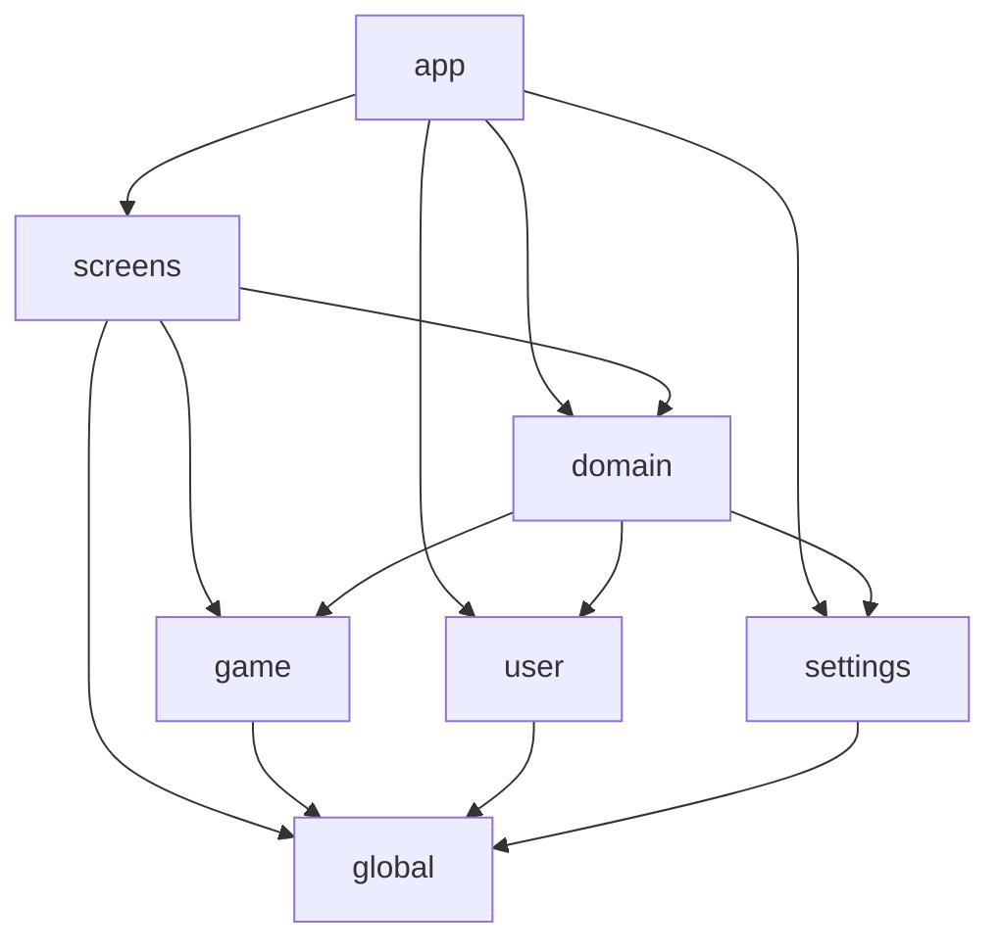

# ChessGym

A fully offline Android application for chess improvement through puzzles, board visualization, and blind play.

<!-- CI badges are powered by a GitHub Actions workflow (.github/workflows/update-badges.yml)   -->
<!-- that syncs TeamCity commit statuses into a Gist consumed by shields.io endpoint badges.     -->
[](https://github.com/paulcraciunas/ChessGym)
[](https://github.com/paulcraciunas/ChessGym)
[](https://github.com/paulcraciunas/ChessGym)
<!-- TODO: Add test count badge (e.g. via shields.io endpoint) when test reporting is configured -->
<!-- TODO: Add latest stable release badge once releases are published -->

[](LICENSE)
[](https://kotlinlang.org)
[](https://developer.android.com/about/versions/oreo/android-8.1)

---

## Features

ChessGym provides access to approximately **4 million chess puzzles** that are provisioned locally on first launch, enabling a fully offline experience with no internet required during gameplay.

| Mode | Description |
|------|-------------|
| **Rated Puzzles** | Solve puzzles matched to the player's current Elo rating. Rating adjusts dynamically based on performance. |
| **Puzzle Streak** | Solve as many consecutive puzzles as possible without making a single mistake. |
| **Puzzle Rush** | Solve as many puzzles as possible under time pressure. |
| **Replay Failed** | Revisit and retry previously failed puzzles to reinforce learning. |
| **Board Visualization** | Training exercises for square recognition and piece placement to build board awareness. |
| **Blind Mode** | Play a full game against the Stockfish engine without seeing the board — the ultimate visualization challenge. |

## Screenshots

<!-- TODO: Add app screenshots or GIFs here. Recommended screens: Home, Rated Puzzle, Board Visualization, Blind Mode -->

*Coming soon.*

## Architecture

ChessGym follows **Clean Architecture** principles with a strict modular separation across approximately 40 Gradle modules. Each feature is split into `api`, `impl`, and `di` layers to enforce dependency inversion and clear boundaries.

- **MVVM** pattern with Jetpack Compose for the UI layer
- **Single-activity** architecture with Compose Navigation
- **Use Cases** connect ViewModels to the data/domain layer
- **Repository pattern** for data persistence
- **Convention Plugins** (via `build-logic` included build) ensure consistent module configuration



## Tech Stack

| Category | Library | Version |
|----------|---------|---------|
| Language | [Kotlin](https://kotlinlang.org) | 2.1 |
| UI | [Jetpack Compose](https://developer.android.com/jetpack/compose) (BOM) | 2025.05.01 |
| Design | [Material 3](https://m3.material.io) | — |
| Navigation | [Compose Navigation](https://developer.android.com/jetpack/compose/navigation) | 2.9 |
| Async | [Kotlin Coroutines & Flows](https://kotlinlang.org/docs/coroutines-overview.html) | 1.10 |
| DI | [Hilt](https://dagger.dev/hilt/) | 2.56 |
| Database | [Room](https://developer.android.com/training/data-storage/room) | 2.7 |
| Preferences | [DataStore](https://developer.android.com/topic/libraries/architecture/datastore) | 1.1 |
| Background Work | [WorkManager](https://developer.android.com/topic/libraries/architecture/workmanager) | 2.10 |
| Serialization | [Kotlinx Serialization](https://github.com/Kotlin/kotlinx.serialization) | 1.8 |
| Compression | [zstd-jni](https://github.com/luben/zstd-jni) | 1.5 |
| Logging | [Timber](https://github.com/JakeWharton/timber) | 5.0 |
| Chess Engine | [Stockfish](https://stockfishchess.org) (native C++ via JNI) | 11 |
| Testing | [JUnit 5](https://junit.org/junit5/), [Espresso](https://developer.android.com/training/testing/espresso), Compose UI Testing | — |
| Build | Gradle (Kotlin DSL), Version Catalog, Convention Plugins | — |
| CI | [TeamCity](https://www.jetbrains.com/teamcity/) (Kotlin DSL) | — |
| Lint | Custom lint rules module | — |

## Integrations

### Stockfish Chess Engine

ChessGym embeds [Stockfish 11](https://stockfishchess.org) as a native C++ library accessed through JNI (located in `game/engine/impl`). It powers the **Blind Mode** feature, allowing users to play a full game against a chess engine without visual board feedback. Communication with the engine follows the standard [UCI (Universal Chess Interface)](https://www.chessprogramming.org/UCI) protocol.

### Lichess Puzzle Database

The puzzle library (~4 million puzzles) originates from the [Lichess open puzzle database](https://database.lichess.org/#puzzles). Puzzles are compressed using [Zstandard](https://facebook.github.io/zstd/) and provisioned into a local [Room](https://developer.android.com/training/data-storage/room) database on first launch.

## Getting Started

### Prerequisites

- [Android Studio](https://developer.android.com/studio) (latest stable recommended)
- JDK 17 or higher
- Android SDK with API level 35 installed

### Build & Run

```bash
# Clone the repository
git clone https://github.com/paulcraciunas/ChessGym.git
cd ChessGym

# Build the debug APK
./gradlew assembleDebug

# Run all unit tests
./gradlew unitTestAllDebug

# Run lint checks
./gradlew lintAllDebug
```

Alternatively, open the project in Android Studio, let Gradle sync, and run the `app` configuration on an emulator or device.

### Requirements

| | Version |
|---|---------|
| **Min SDK** | 27 (Android 8.1 Oreo) |
| **Target SDK** | 35 (Android 15) |
| **Compile SDK** | 35 |

## Continuous Integration

CI is managed through [TeamCity](https://www.jetbrains.com/teamcity/) using Kotlin DSL (configuration lives in `.teamcity/`). The following build configurations are registered:

| Build | Gradle Task | Description |
|-------|-------------|-------------|
| **Build Debug** | `clean assembleDebug` | Assembles the debug APK and publishes it as an artifact |
| **Unit Tests** | `clean unitTestAllDebug` | Runs all unit tests across every module |
| **Lint Debug** | `clean lintAllDebug` | Runs all custom lint checks across every module |

All builds are triggered automatically on every branch, with full GitHub Pull Request integration and commit status publishing.

## Project Structure

```
ChessGym/
├── app/                  # Application entry point, navigation graph, DI wiring
├── game/
│   ├── logic/            # Core chess logic (move validation, game state)
│   ├── puzzles/          # Puzzle loading, rating, and management
│   ├── engine/           # Stockfish integration (native C++ / JNI)
│   └── serializer/       # Puzzle serialization and deserialization
├── screens/
│   ├── common/           # Shared UI components (chessboard, pieces, themes)
│   ├── home/             # Home / dashboard screen
│   ├── loading/          # Puzzle provisioning / loading screen
│   ├── puzzles/
│   │   ├── dashboard/    # Puzzle mode selection
│   │   ├── rated/        # Rated puzzle gameplay
│   │   ├── rush/         # Puzzle rush mode
│   │   ├── streak/       # Puzzle streak mode
│   │   └── failed/       # Replay failed puzzles
│   ├── boardvis/
│   │   ├── dashboard/    # Board visualization mode selection
│   │   ├── squares/      # Square recognition training
│   │   └── pieces/       # Piece placement training
│   ├── blindmode/        # Blind mode (play vs Stockfish)
│   ├── settings/         # App settings screen
│   └── about/            # About screen
├── domain/               # Domain layer (use cases)
├── user/                 # User profile, rating, and statistics
├── settings/             # Application preferences (DataStore)
├── global/
│   ├── device/           # Device capabilities and info
│   ├── notifications/    # Notification management
│   ├── resources/        # Shared resources (strings, drawables)
│   └── utils/            # Cross-cutting utilities
├── build-logic/          # Convention plugins (Kotlin DSL)
├── lint-rules/           # Custom lint checks
├── .teamcity/            # TeamCity CI configuration (Kotlin DSL)
└── gradle/               # Version catalog (libs.versions.toml)
```

Each feature module follows the `api` / `impl` / `di` convention to enforce clean dependency boundaries.

## Contributing

ChessGym is a personal project. If you encounter bugs or have suggestions, feel free to [open an issue](https://github.com/paulcraciunas/ChessGym/issues).

<!-- TODO: Add CONTRIBUTING.md with detailed guidelines if the project opens to external contributors -->

## Author

**Paul Mihai Craciunas**

- GitHub: [@paulcraciunas](https://github.com/paulcraciunas)

<!-- TODO: Add additional contact links (LinkedIn, email) if desired -->

## License

This project is licensed under the **GNU General Public License v3.0** — see the [LICENSE](LICENSE) file for details.

ChessGym uses [Stockfish](https://stockfishchess.org), which is distributed under the GPL-3.0 license. As a derivative work incorporating Stockfish, this project is licensed under the same terms.

## Acknowledgments

- [Lichess](https://lichess.org) — for making the puzzle database freely available under a Creative Commons license
- [Stockfish](https://stockfishchess.org) — for the world's strongest open-source chess engine
- [Lichess Puzzle Database](https://database.lichess.org/#puzzles) — source of the ~4 million puzzles used in this app
- [Jetpack Compose](https://developer.android.com/jetpack/compose) — for the modern declarative UI toolkit
- [Zstandard](https://facebook.github.io/zstd/) — for efficient real-time compression of the puzzle database
