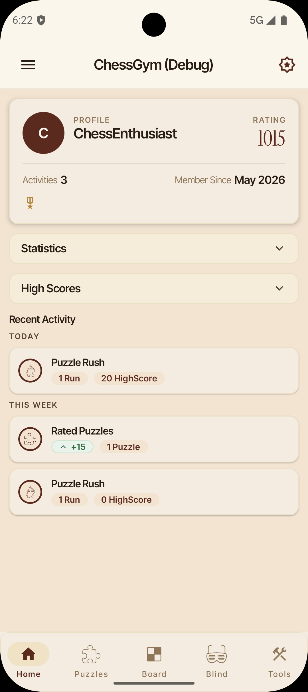
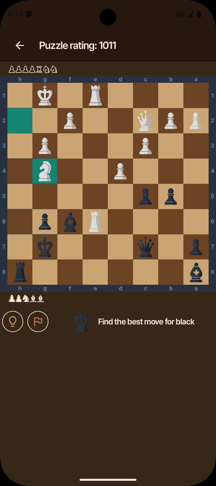
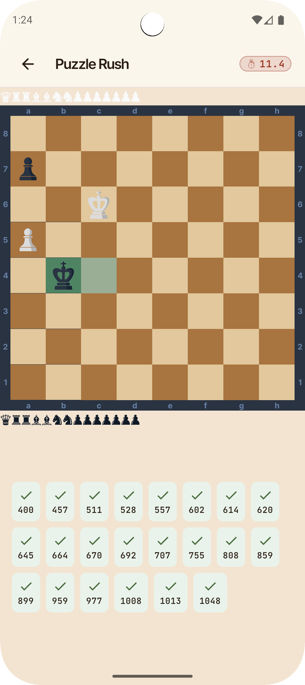
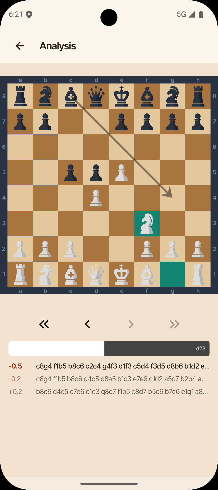
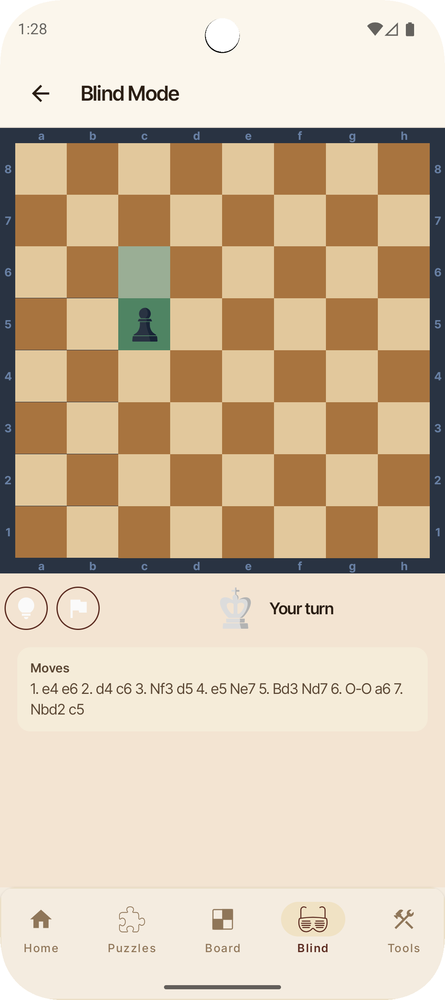
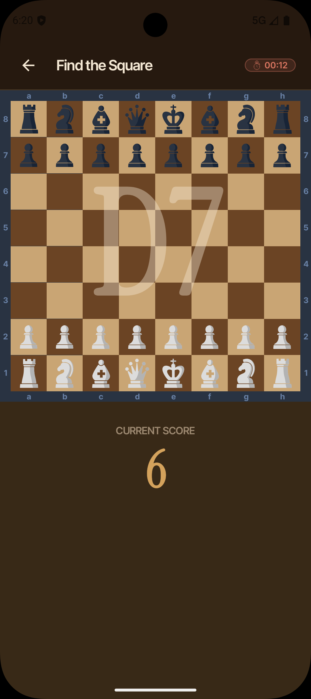
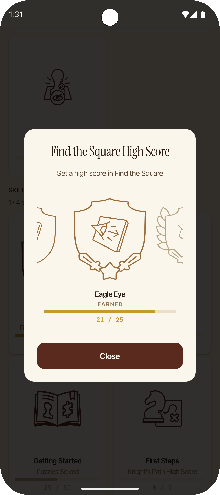
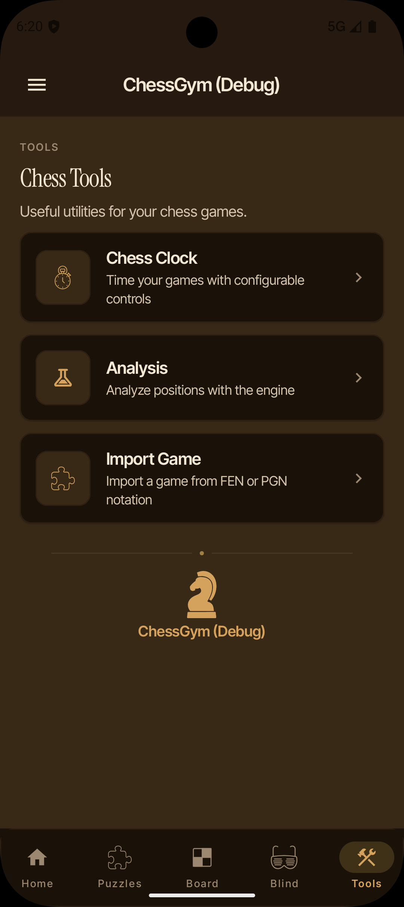
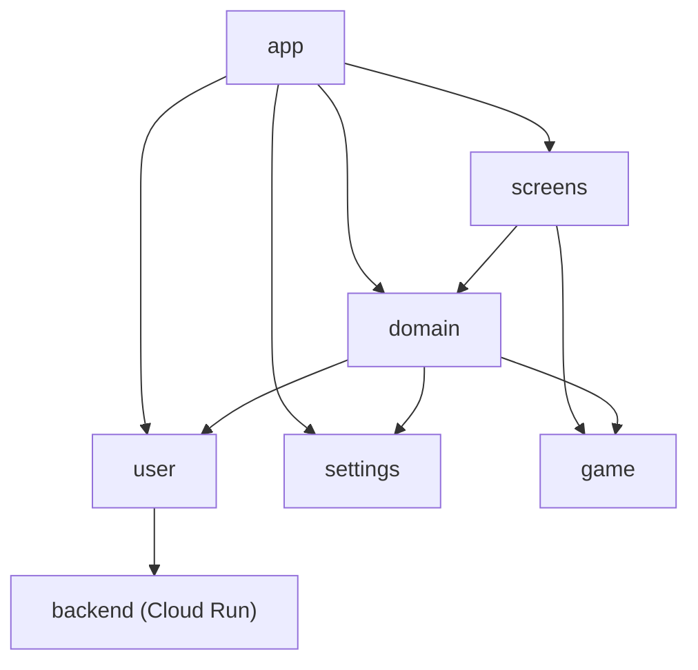

# ChessGym

Solve millions of chess puzzles offline. Improve with rated tactics, timed challenges, blindfold games, a full analysis board, and 100+ achievements to earn.

<!-- CI badges are powered by a GitHub Actions workflow (.github/workflows/update-badges.yml)   -->
<!-- that syncs TeamCity commit statuses into a Gist consumed by shields.io endpoint badges.     -->
[](https://github.com/paulcraciunas/ChessGym)
[](https://github.com/paulcraciunas/ChessGym)
[](https://github.com/paulcraciunas/ChessGym)

[](LICENSE)
[](https://kotlinlang.org)
[](https://developer.android.com/about/versions/oreo/android-8.1)

---

## Features

ChessGym provides access to up to **~6 million chess puzzles** that are provisioned locally on first launch, enabling a fully offline experience with no internet required during gameplay.

| Mode                    | Description                                                                                                                        |
|-------------------------|------------------------------------------------------------------------------------------------------------------------------------|
| **Rated Puzzles**       | Solve puzzles matched to the player's current Elo rating. Rating adjusts dynamically based on performance.                         |
| **Puzzle Streak**       | Solve as many consecutive puzzles as possible without making a single mistake.                                                     |
| **Puzzle Rush**         | Solve as many puzzles as possible under time pressure.                                                                             |
| **Replay Failed**       | Revisit and retry previously failed puzzles to reinforce learning.                                                                 |
| **Board Visualization** | Training exercises for square recognition and piece placement to build board awareness.                                            |
| **Blind Mode**          | Play a full game against the Stockfish engine without seeing the board — the ultimate visualization challenge.                     |
| **Analysis Board**      | A full interactive board for analyzing positions, exploring variations, and studying games.                                        |
| **Import Game**         | Import PGN games and step through moves on the analysis board.                                                                     |
| **Chess Clock**         | Configurable chess clock for over-the-board play.                                                                                  |
| **Achievements**        | Over 100 achievements to earn, ranging from beginner milestones to expert-level challenges. Tracks progress across all game modes. |

## Screenshots

<!-- Add screenshots to the screenshots/ directory. Recommended: 01_home.png through 08_tools_dashboard.png -->

|                                              |                                                                |                                                  |                                                      |
|----------------------------------------------|----------------------------------------------------------------|--------------------------------------------------|------------------------------------------------------|
|              |                |    |  |
|  |  |  |          |

## Architecture

ChessGym follows **Clean Architecture** principles with a strict modular separation across approximately 70 Gradle modules. Each feature is split into `api`, `impl`, and `di` layers to enforce dependency inversion and clear boundaries.

- **MVVM** pattern with Jetpack Compose for the UI layer
- **Single-activity** architecture with Compose Navigation
- **Use Cases** connect ViewModels to the data/domain layer
- **Repository pattern** for data persistence
- **Convention Plugins** (via `build-logic` included build) ensure consistent module configuration
- **Standalone backend** (Ktor on Cloud Run) for optional cloud sync



## Tech Stack

| Category              | Library                                                                                                                                          | Version    |
|-----------------------|--------------------------------------------------------------------------------------------------------------------------------------------------|------------|
| Language              | [Kotlin](https://kotlinlang.org)                                                                                                                 | 2.3        |
| UI                    | [Jetpack Compose](https://developer.android.com/jetpack/compose) (BOM)                                                                           | 2026.03.00 |
| Design                | [Material 3](https://m3.material.io)                                                                                                             | —          |
| Navigation            | [Compose Navigation](https://developer.android.com/jetpack/compose/navigation)                                                                   | 2.9.8      |
| Async                 | [Kotlin Coroutines & Flows](https://kotlinlang.org/docs/coroutines-overview.html)                                                                | 1.10.2     |
| DI                    | [Hilt](https://dagger.dev/hilt/)                                                                                                                 | 2.59.2     |
| Database              | [Room](https://developer.android.com/training/data-storage/room)                                                                                 | 2.8.4      |
| Preferences           | [DataStore](https://developer.android.com/topic/libraries/architecture/datastore)                                                                | 1.2        |
| Background Work       | [WorkManager](https://developer.android.com/topic/libraries/architecture/workmanager)                                                            | 2.11.2     |
| Networking            | [Ktor Client](https://ktor.io) (OkHttp engine)                                                                                                   | 3.4.3      |
| Serialization         | [Kotlinx Serialization](https://github.com/Kotlin/kotlinx.serialization)                                                                         | 1.11.0     |
| Compression           | [zstd-jni](https://github.com/luben/zstd-jni)                                                                                                    | 1.5.7      |
| Auth                  | [Firebase Auth](https://firebase.google.com/docs/auth) + [Credential Manager](https://developer.android.com/identity/sign-in/credential-manager) | —          |
| Billing               | [Google Play Billing](https://developer.android.com/google/play/billing)                                                                         | 9.0.0      |
| Logging               | [Timber](https://github.com/JakeWharton/timber)                                                                                                  | 5.0        |
| Crash Reporting       | [Firebase Crashlytics](https://firebase.google.com/docs/crashlytics)                                                                             | —          |
| Chess Engine          | [Stockfish](https://stockfishchess.org) (native C++ via JNI)                                                                                     | 11         |
| Testing               | [JUnit 5](https://junit.org/junit5/), [Espresso](https://developer.android.com/training/testing/espresso), Compose UI Testing                    | —          |
| Build                 | [Gradle](https://gradle.org) (Kotlin DSL), Version Catalog, Convention Plugins                                                                   | 9.5        |
| Android Gradle Plugin | [AGP](https://developer.android.com/build)                                                                                                       | 9.2.1      |
| CI                    | [TeamCity](https://www.jetbrains.com/teamcity/) (Kotlin DSL) + [GitHub Actions](https://github.com/features/actions)                             | —          |
| Lint                  | Custom lint rules module                                                                                                                         | —          |

## Puzzle Database

Puzzles originate from the [Lichess open puzzle database](https://database.lichess.org/#puzzles) and are converted into a custom binary serialization format for memory-efficient storage. Three database tiers are available, selectable on first launch:

| Tier        | Puzzles   | Size (uncompressed) | Size (archived) |
|-------------|-----------|---------------------|-----------------|
| **Full**    | 5,939,980 | 329.7 MB            | 185 MiB         |
| **Compact** | 2,385,719 | 131.2 MB            | 76 MB           |
| **Lite**    | 606,248   | 32.9 MB             | 20 MB           |

The databases are built via the `tools/puzzle-db-builder` module and published as [GitHub Releases](https://github.com/paulcraciunas/ChessGym/releases). The `tools/puzzle-verifier` module plays through every single puzzle to ensure correctness before release.

Puzzles are compressed using [Zstandard](https://facebook.github.io/zstd/) and provisioned into a local [Room](https://developer.android.com/training/data-storage/room) database on first launch.

## Integrations

### Stockfish Chess Engine

ChessGym embeds [Stockfish 11](https://stockfishchess.org) as a native C++ library accessed through JNI (located in `game/engine/impl`). It powers the **Blind Mode** feature, allowing users to play a full game against a chess engine without visual board feedback. Communication with the engine follows the standard [UCI (Universal Chess Interface)](https://www.chessprogramming.org/UCI) protocol.

### Backend

A standalone [Ktor 3](https://ktor.io) backend runs on **Google Cloud Run**, backed by **Cloud Firestore** and **Firebase Authentication**. It enables optional cloud sync of user profiles, ratings, and achievement progress.

Key capabilities:
- Firebase Auth token verification
- User CRUD and profile management
- Achievement and statistics synchronization
- Health and OpenAPI/Swagger endpoints

The backend is a separate Gradle project located in [`backend/`](backend).

## Getting Started

### Prerequisites

- [Android Studio](https://developer.android.com/studio) (latest stable recommended)
- JDK 17 or higher
- Android SDK with API level 36 installed

### Build & Run

```bash
# Clone the repository
git clone https://github.com/paulcraciunas/ChessGym.git
cd ChessGym

# Set up Firebase configuration (see below)
cp app/google-services.json.template app/google-services.json

# Build the debug APK
./gradlew assembleDebug

# Run all unit tests
./gradlew unitTestAllDebug

# Run lint checks
./gradlew lintAllDebug
```

Alternatively, open the project in Android Studio, let Gradle sync, and run the `app` configuration on an emulator or device.

### Firebase Configuration

ChessGym uses Firebase for crash reporting and authentication. The real `google-services.json` is not committed to the repository for security reasons.

**For contributors / building from source:** Copy the provided template to get a buildable project:

```bash
cp app/google-services.json.template app/google-services.json
```

The app will build and run normally with this placeholder. Firebase features (crash reporting, authentication) will simply be non-functional. If you want working Firebase integration, create your own [Firebase project](https://console.firebase.google.com/) and download the `google-services.json` for your registered Android app.

### Requirements

|                 | Version               |
|-----------------|-----------------------|
| **Min SDK**     | 27 (Android 8.1 Oreo) |
| **Target SDK**  | 37 (Android 17)       |
| **Compile SDK** | 37                    |

## Continuous Integration

CI is split between **TeamCity** (Android app) and **GitHub Actions** (backend, puzzle database, badge sync).

### TeamCity (Kotlin DSL)

Configuration lives in `.teamcity/`. All builds trigger automatically on every branch with full GitHub Pull Request integration and commit status publishing.

| Build                   | Gradle Task              | Description                                                           |
|-------------------------|--------------------------|-----------------------------------------------------------------------|
| **Build Debug**         | `clean assembleDebug`    | Assembles the debug APK and publishes it as an artifact               |
| **Unit Tests**          | `clean unitTestAllDebug` | Runs all unit tests across every module                               |
| **Lint Debug**          | `clean lintAllDebug`     | Runs all custom lint checks across every module                       |
| **Puzzle Verification** | `puzzle-verifier:run`    | Plays through every puzzle in the database to ensure all are solvable |

### GitHub Actions

| Workflow              | Trigger                            | Description                                                                 |
|-----------------------|------------------------------------|-----------------------------------------------------------------------------|
| `backend-ci.yml`      | Push/PR to `master` (`backend/**`) | Builds and tests the Ktor backend                                           |
| `backend-deploy.yml`  | Manual (workflow_dispatch)         | Deploys the backend to Google Cloud Run                                     |
| `build-puzzle-db.yml` | Manual                             | Downloads Lichess CSV, builds tiered databases, publishes as GitHub Release |
| `update-badges.yml`   | GitHub status events + manual      | Syncs TeamCity commit statuses to Gist for shields.io badges                |

## Project Structure

```
ChessGym/
├── app/                    # Application entry point, navigation graph, DI wiring
├── backend/                # Ktor backend (Cloud Run, Firestore, Firebase Auth) — separate Gradle project
├── game/
│   ├── logic/              # Core chess logic (move validation, game state)
│   ├── puzzles/            # Puzzle loading, rating, and management
│   ├── engine/             # Stockfish integration (native C++ / JNI)
│   └── serializer/         # Puzzle serialization and deserialization
├── screens/
│   ├── common/             # Shared UI components (chessboard, pieces, themes)
│   ├── home/               # Home / dashboard screen
│   ├── loading/            # Puzzle provisioning / database tier selection
│   ├── puzzles/
│   │   ├── dashboard/      # Puzzle mode selection
│   │   ├── rated/          # Rated puzzle gameplay
│   │   ├── rush/           # Puzzle rush mode
│   │   ├── streak/         # Puzzle streak mode
│   │   └── failed/         # Replay failed puzzles
│   ├── boardvis/
│   │   ├── dashboard/      # Board visualization mode selection
│   │   ├── squares/        # Square recognition training
│   │   └── pieces/         # Piece placement training
│   ├── blindmode/          # Blind mode (play vs Stockfish)
│   ├── tools/
│   │   ├── dashboard/      # Tools section selection
│   │   ├── analysis/       # Analysis board
│   │   ├── importgame/     # PGN import
│   │   └── clock/          # Chess clock
│   ├── achievements/       # Achievements screen
│   ├── signin/             # Sign-in screen
│   ├── settings/           # App settings screen
│   └── about/              # About screen (libraries, privacy policy, legal)
├── domain/                 # Domain layer (use cases)
├── user/
│   ├── api/                # User abstractions
│   ├── impl/               # Local user data
│   ├── remote/             # Remote sync (Ktor Client)
│   └── di/                 # DI wiring (Firebase Auth, networking)
├── settings/               # Application preferences (DataStore)
├── global/
│   ├── billing/            # Google Play Billing integration
│   ├── device/             # Device capabilities and info
│   ├── notifications/      # Notification management
│   ├── resources/          # Shared resources (strings, drawables)
│   └── utils/              # Cross-cutting utilities
├── tools/
│   ├── puzzle-db-builder/  # Converts Lichess CSV into tiered .db files
│   └── puzzle-verifier/    # Validates all puzzles are solvable
├── build-logic/            # Convention plugins (Kotlin DSL)
├── lint-rules/             # Custom lint checks
├── .teamcity/              # TeamCity CI configuration (Kotlin DSL)
├── .github/                # GitHub Actions workflows
└── gradle/                 # Version catalog (libs.versions.toml)
```

Each feature module follows the `api` / `impl` / `di` convention to enforce clean dependency boundaries.

## Contributing

ChessGym is a personal project. If you encounter bugs or have suggestions, feel free to [open an issue](https://github.com/paulcraciunas/ChessGym/issues).

## Author

**Paul Mihai Craciunas**

- GitHub: [@paulcraciunas](https://github.com/paulcraciunas)

## License

This project is licensed under the **GNU General Public License v3.0** — see the [LICENSE](LICENSE) file for details.

ChessGym uses [Stockfish](https://stockfishchess.org), which is distributed under the GPL-3.0 license. As a derivative work incorporating Stockfish, this project is licensed under the same terms.

The [`backend/`](backend) module is licensed separately — see [`backend/LICENSE`](backend/LICENSE).

## Acknowledgments

- [Lichess](https://lichess.org) — for making the puzzle database freely available under a Creative Commons license
- [Stockfish](https://stockfishchess.org) — for the world's strongest open-source chess engine
- [Lichess Puzzle Database](https://database.lichess.org/#puzzles) — source of the ~6 million puzzles used in this app
- [Jetpack Compose](https://developer.android.com/jetpack/compose) — for the modern declarative UI toolkit
- [Zstandard](https://facebook.github.io/zstd/) — for efficient real-time compression of the puzzle database
- [Ktor](https://ktor.io) — for the lightweight Kotlin-first server and client framework
